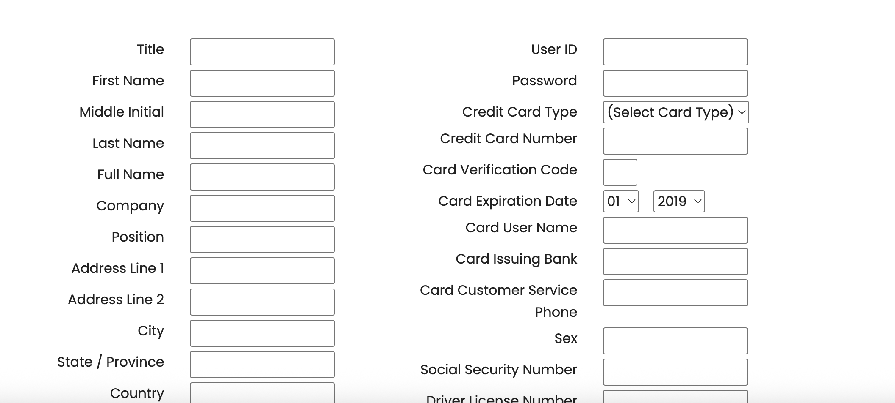
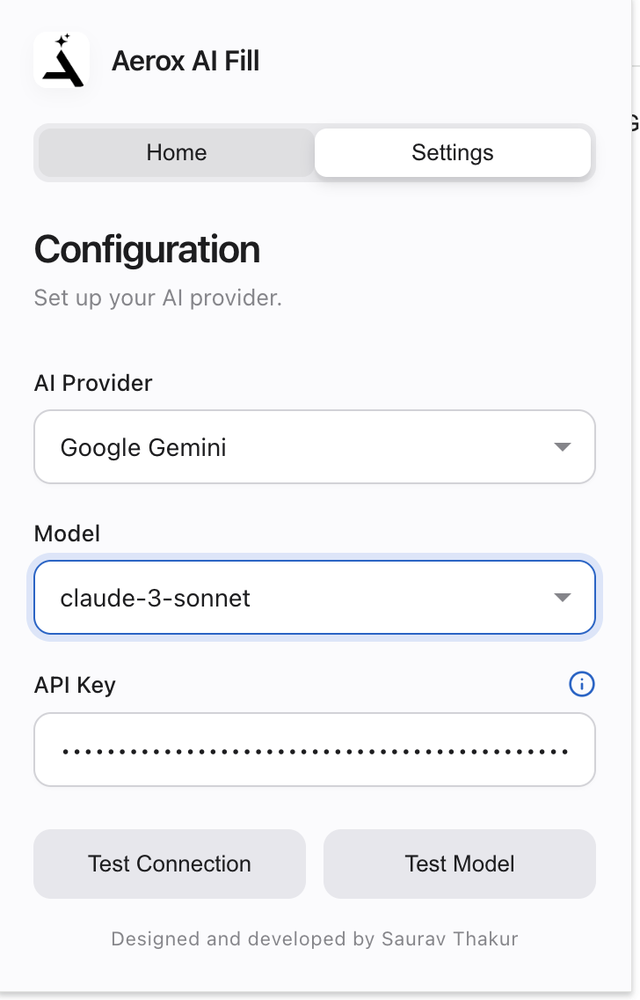
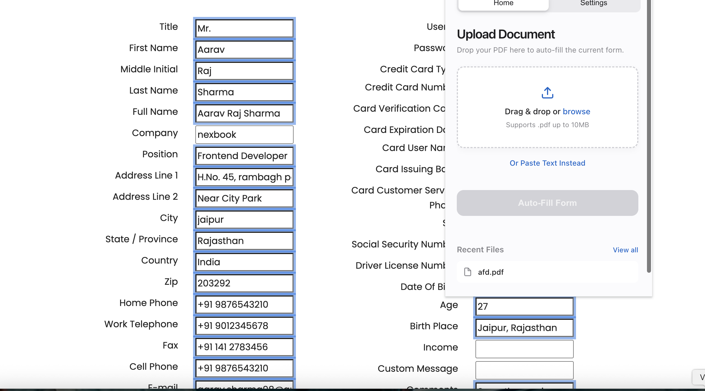

# Aerox AI Fill

Effortlessly supercharge web forms with intelligence. Extract context directly from your documents or clipboard, and let AI automatically populate fields for you. Crafted with a premium, seamless glassmorphism UI for high-performance professionals.

<p align="center">
  
</p>

## Features

* **Intelligent Document Parsing**: Extracts structural data instantly from local PDFs, keeping your workflow fluid.
* **Universal LLM Support**: Bring your own keys (BYOK) for OpenAI (GPT-4), Anthropic (Claude), Google Gemini, Groq, or custom AI endpoints.
* **Smart Failover System**: Add up to 7 secondary API keys. If your primary key rate-limits or fails, Aerox AI instantly falls back to ensure zero interruptions.
* **High-Privacy Local Execution**: Documents are parsed locally via IndexedDB and `pdf.js`. Original files never leave your device.
* **Context-Aware Mapping**: Seamlessly evaluates HTML structural context (`name`, `aria-label`, `placeholder`) to align document data precisely with target fields.
* **Manual Override & Paste Zones**: Drop in plain text snippets for instantaneous data structuring without a file.

## Use Cases

* **Recruiters & HR**: Instantly auto-fill complex applicant tracking systems (ATS) using a candidate's PDF resume.
* **Freelancers**: Map client briefs into structured project forms accurately.
* **Data Entry Professionals**: Migrate massive textual documents into structured database interfaces in fractions of a second.
* **Agencies**: Streamline lead generation input directly from proposal PDFs.

## Installation

This extension is built for Chrome, Edge, Brave, and other Chromium-based browsers.

### Developer Loading
1. Clone this repository directly or download the source code.
   ```bash
   git clone https://github.com/SauravThakur/aerox-ai-fill.git
   ```
2. Open Chrome and navigate to `chrome://extensions`.
3. Toggle on **Developer mode** in the top-right corner.
4. Click **Load unpacked** and select the directory containing the cloned repository.
5. Pin the extension to your toolbar.

## Usage Guide

Experience a premium flow designed for maximum efficiency. Follow these steps to map intelligence to any web form:

**1. Configure API**  
Click the extension icon, head to the Settings tab, and input your primary API Keys. Add your preferred foundational model seamlessly.  
<p align="center"></p>

**2. Add Fallbacks (Optional)**  
Ensure resilience by adding backup keys ensuring high availability. If the primary key fails, the extension automatically routes the request to secondary endpoints.  
<p align="center"></p>

**3. Upload Document Context**  
Switch to the Home tab and drag & drop any PDF, or switch to Text Mode to paste raw context for immediate extraction.  
<p align="center"></p>

**4. Execute Auto-Fill**  
Navigate to your desired form, click "Fill Form", and watch context structure itself dynamically across all visible inputs.  
<p align="center"></p>

## How It Works

Aerox AI Fill bridges document parsing and DOM manipulation through contextual prompt engineering:
1. **Extraction**: Utilizing `pdf.min.js`, the local worker strips textual content layer by layer via `Uint8Array` buffers, caching it through IndexedDB for persistence.
2. **DOM Scanning**: `content.js` inspects the active tab, filtering visible inputs, selects, and textareas, grabbing identifiers (`id`, `name`, `aria-label`).
3. **Synthesis**: The `background.js` Service Worker forwards the prompt structure securely to your chosen LLM (OpenAI, Anthropic, etc.).
4. **Injection**: The LLM returns a strictly mapped JSON object, dynamically dispatched back to `content.js` to dispatch values and trigger UI frameworks.

## Project Structure

```text
├── assets/             # Extension UI presentation images
├── background.js       # Background Service Worker (AI routing & network resilience)
├── content.js          # DOM interaction, Form Extraction & Data Injection
├── manifest.json       # Chrome Manifest V3 setup
├── popup.css           # Premium Glassmorphism visual design styling
├── popup.html          # Extension interface markup (Home, Settings, Modals)
├── popup.js            # Front-end state handling, UI transitions, IndexedDB config
├── pdf.min.js          # Client-side PDF parsing engine logic
└── pdf.worker.min.js   # Background worker thread purely dedicated to PDF slicing
```

## Configuration

If using a Custom provider, specify the base endpoint carefully:
- Open-Source Endpoint Example: `http://localhost:11434/v1/chat/completions` (Ollama)
- Logic relies wholly on Chrome Local Storage. Use the Settings UI to securely save your API keys inside the `chrome.storage.local` sandbox.

## Tech Stack

* **Core**: Vanilla JavaScript (ES6+), HTML5, CSS3
* **Extension Runtime**: Chrome Extensions API (Manifest V3)
* **Storage**: IndexedDB (Fast persistence), Chrome Storage API
* **Parsing Engine**: Mozilla PDF.js
* **Integrations**: OpenAI, Anthropic, Gemini, Groq (via Fetch API natively)

## Roadmap

- [ ] Support for parsing Word documents (.docx)
- [ ] Auto-detect forms on page load without manual trigger
- [ ] Customizable System Prompts for advanced prompt engineers
- [ ] Multi-language support mapping
- [ ] Direct export options to JSON/CSV 

## Contributing

We welcome community contributions. Read our [Contributing Guide](CONTRIBUTING.md) to learn how to format your code, submit PRs, and suggest enhancements.

## License

This project is open-sourced under the **MIT License**. Check the `LICENSE` file for full details.

## Author

**Saurav Thakur**  
AI Engineer | Founder | Built 46+ AI systems  

An expert in AI, GenAI, and Agentic Systems, Saurav has developed 21+ apps and built 4 AI startups, delivering innovative automation tools currently serving over **22,000+ users** worldwide. Aerox AI Fill was crafted as a production-grade browser system to demonstrate how deep intelligence can natively interact with the web ecosystem.
